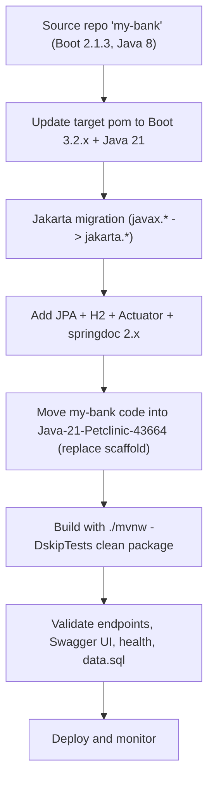

# my-bank to Java 21 Migration and Modernization Guide (into Java-21-Petclinic-43664)

## Executive Summary
This guide describes how to migrate the my-bank REST API application from its current Spring Boot 2.1.x and Java 8 stack to a fully Java 21-compatible stack based on Spring Boot 3.x, and to relocate the application into the Java-21-Petclinic-43664 repository. The objective is to preserve all current behavior, API contracts, and data model while modernizing the build, dependencies, and runtime. The migration includes Jakarta package updates, upgrading to a Spring Boot 3-compatible dependency set, and ensuring Swagger/OpenAPI, CORS, and health endpoints are configured and working.

Target environment goals:
- Java 21 runtime and compilation
- Spring Boot 3.2.x/3.3.x
- Jakarta namespaces for JPA/Validation/Servlet where applicable
- Springdoc 2.x for OpenAPI in Boot 3
- H2 for in-memory DB with data.sql seeding
- Maven wrapper (Maven 3.9.x), with compiler configured for release 21

Scope:
- Build and dependencies
- Source code (imports and minor framework alignment)
- Configuration and data
- Observability (health) and CORS
- Migration into the Java-21-Petclinic-43664 repository
- No functional changes to my-bank endpoints or API payloads

## Current State Assessment
The my-bank application is a Spring Boot REST service exposing CRUD-style operations for bank accounts. It uses H2 as an in-memory database and Spring Data JPA for persistence. Current notable characteristics:
- Spring Boot version: 2.1.3.RELEASE (inherited from spring-boot-starter-parent)
- Java compatibility: Java 8 (property <java.version>1.8</java.version>)
- Dependencies: spring-boot-starter-data-jpa, spring-boot-starter-data-rest, com.h2database:h2, springdoc-openapi-ui:1.6.x, spring-boot-starter-test (JUnit 4)
- Build: Maven with Spring Boot Maven plugin; Maven wrapper included
- Configuration: application.properties (empty; relies on defaults); data.sql seeds initial records
- Domain: Account entity (id, name, balance); AccountRepository extends JpaRepository
- Controller: AccountController exposes:
  - GET /accounts/all
  - GET /accounts/{id}
  - POST /accounts/new
  - PUT /accounts/{id}?amount=<double>
  - DELETE /accounts/{id}
- Exception handling: ResourceNotFoundException annotated with @ResponseStatus(HttpStatus.NOT_FOUND)
- OpenAPI: OpenApiConfig present; Swagger UI available (via springdoc)
- Tests: MyBankAppTests uses JUnit 4 (SpringRunner) and TestRestTemplate with RANDOM_PORT
- Runtime: Default port 8080 unless overridden by system properties or args; helper scripts exist for binding to specific ports

Known files in the my-bank repository:
- pom.xml
- src/main/java/com/marcoslombog/mybank/App.java
- src/main/java/com/marcoslombog/mybank/controller/AccountController.java
- src/main/java/com/marcoslombog/mybank/model/Account.java
- src/main/java/com/marcoslombog/mybank/repository/AccountRepository.java
- src/main/java/com/marcoslombog/mybank/exception/ResourceNotFoundException.java
- src/main/java/com/marcoslombog/mybank/config/OpenApiConfig.java
- src/main/resources/application.properties
- src/main/resources/data.sql
- src/test/java/com/marcoslombog/mybank/MyBankAppTests.java

Current preview/start expectations: The app runs on 8080 by default, with the ability to set server.port and server.address via JVM arguments or Spring Boot args.

## Target State Architecture & Compatibility Matrix
After migration, the application will be compiled and executed with Java 21, using Spring Boot 3.2.x/3.3.x. Boot 3 introduces Jakarta namespace changes that require javax.* imports to be updated to jakarta.* for JPA, validation, and servlet APIs. The REST API surface must remain unchanged.

Target versions and components:
- Java: 21
- Spring Boot: 3.2.x or 3.3.x
- OpenAPI: springdoc-openapi-starter-webmvc-ui 2.x
- Spring Data JPA: Boot 3-aligned (Hibernate 6)
- H2: Latest compatible via Boot dependency management
- Maven: Compiler plugin with <release>21</release>; Wrapper configured to Maven 3.9.x

Compatibility and impact:
- javax.persistence.* → jakarta.persistence.* (Account entity)
- javax.validation.* → jakarta.validation.* (Account entity, @Valid in controllers)
- javax.servlet.* → jakarta.servlet.* if used (not present in current code)
- Spring Boot testing: migrate JUnit 4 → JUnit 5 (Jupiter) if tests are upgraded now; LocalServerPort import moves from org.springframework.boot.web.server.LocalServerPort to org.springframework.boot.test.web.server.LocalServerPort
- API endpoints and payloads remain unchanged:
  - /accounts/all
  - /accounts/{id}
  - /accounts/new
  - /accounts/{id} PUT with ?amount=<double>

## Detailed Migration Plan (Step-by-step)

### A. Repository Strategy
- Create a new branch in the Java-21-Petclinic-43664 repository (e.g., feature/my-bank-java21).
- Preserve a reference to the original my-bank repository (e.g., by tagging or keeping a separate backup branch in a fork) to support rollback and history reference.
- In the Java-21-Petclinic-43664 repo, replace the scaffold Petclinic sample code with the my-bank code:
  - Remove Petclinic-specific packages (com.example.petclinic.*) and sample controllers that are not needed.
  - Copy my-bank source code under src/main/java/com/marcoslombog/mybank and src/test/java/com/marcoslombog/mybank, along with resources (application.properties, data.sql).
  - Ensure the main application class remains com.marcoslombog.mybank.App as the entry point.

Rationale: Keeping the my-bank package and main class preserves component scanning boundaries and minimizes refactors.

### B. Build and Tooling
- Ensure the Maven Wrapper is present in the target repository (Java-21-Petclinic-43664 already includes it). Use ./mvnw consistently.
- Update the target repository pom.xml to a Boot 3-compatible setup:
  - Set Java 21 for maven-compiler-plugin <release>21</release>.
  - Set Spring Boot version to 3.2.x/3.3.x.
  - Dependencies: spring-boot-starter-web, spring-boot-starter-data-jpa, spring-boot-starter-actuator, spring-boot-starter-validation, com.h2database:h2, org.springdoc:springdoc-openapi-starter-webmvc-ui:2.x.
  - Ensure maven-surefire-plugin is compatible (3.2.x) with Java 21.
  - Optionally align using spring-boot-dependencies BOM import (as is done in the target repo).

Rationale: Boot 3 and Java 21 require modernized plugin and dependency versions; springdoc-openapi-starter 2.x is the correct module for Boot 3 (springdoc 1.x is for Boot 2).

### C. Codebase Migration (Jakarta & API)
- Update imports to Jakarta:
  - In Account.java:
    - javax.persistence.* → jakarta.persistence.*
    - javax.validation.constraints.NotBlank → jakarta.validation.constraints.NotBlank
  - In AccountController.java:
    - javax.validation.Valid → jakarta.validation.Valid
  - ResourceNotFoundException and repository interfaces remain unchanged (annotations and APIs are stable).
- Ensure the App.java entry point remains and compiles under Boot 3 (no changes required).
- Verify that there are no legacy javax.* imports lingering in any class after migration (compile will help surface issues).
- Tests (optional now, recommended later):
  - If migrating tests now, replace JUnit 4 with JUnit 5 (Jupiter).
  - Update LocalServerPort import to org.springframework.boot.test.web.server.LocalServerPort.
  - Update annotations from @RunWith(SpringRunner.class) to @ExtendWith(SpringExtension.class) and JUnit 5 @Test.

Rationale: Boot 3 adopts Jakarta EE 9+ namespace changes and JUnit 5 by default. These import changes are mandatory for compatibility.

### D. Configuration & Data
- application.properties:
  - Continue to allow port/address overrides via JVM properties or command-line args; avoid hardcoding server.port.
  - For better observability, enable Actuator endpoints (health/info); see example below.
  - Optionally enable H2 console for development (not necessary for CI/production).
- data.sql:
  - Keep existing seeding of two accounts. Hibernate will create schema automatically when using the in-memory H2 with default settings.

Rationale: Boot 3 retains default auto-configuration suitable for simple H2 + JPA apps. The existing data.sql remains valid.

### E. OpenAPI/Swagger
- Replace springdoc 1.x with springdoc-openapi-starter-webmvc-ui:2.x.
- Provide an OpenApiConfig bean compatible with Boot 3 and springdoc 2.x. Allow overriding the server URL via property or environment variable, e.g.:
  - Property: mybank.openapi.server-url
  - Env var: MYBANK_OPENAPI_SERVER_URL
- Exposed endpoints:
  - Swagger UI: /swagger-ui/index.html (shortcut at /swagger-ui.html)
  - OpenAPI JSON: /v3/api-docs

Rationale: springdoc 2.x aligns with Spring Boot 3 / Spring Framework 6.

### F. Health and Observability (recommended)
- Add spring-boot-starter-actuator and expose health endpoints:
  - /actuator/health (liveness/readiness probes are supported)
- Optionally keep a simple /healthz controller (like the sample in the target repo) to match external checks.

Rationale: Health endpoints are important for deployment readiness checks.

### G. CORS and Security
- Provide a simple CORS configuration that can be controlled via environment variables (e.g., ALLOWED_ORIGINS).
- Ensure allowed methods include GET, POST, PUT, DELETE, OPTIONS and common headers like Content-Type, Authorization.
- If Swagger UI is accessed over HTTPS from a specific origin/host, ensure that origin is allowed.

Rationale: Swagger UI “Try it out” and browser clients should work without CORS issues in the deployment environment.

### H. Packaging & Run
- Standard build:
  - ./mvnw -v should show Java 21
  - ./mvnw -DskipTests clean package should succeed
- Run:
  - ./mvnw spring-boot:run
  - Or packaged jar: java -jar target/mybank-<version>.jar --server.port=3002 --server.address=0.0.0.0

Rationale: Prefer the Maven Wrapper and avoid environment discrepancies; jar run is a stable fallback.

## Acceptance Criteria & Validation Checklist
- Build succeeds with Java 21:
  - ./mvnw -v shows Java 21
  - ./mvnw -DskipTests clean package completes successfully
- API contract preserved:
  - Endpoints exist and respond with the same status codes and payloads:
    - GET /accounts/all
    - GET /accounts/{id}
    - POST /accounts/new
    - PUT /accounts/{id}?amount=<double>
    - DELETE /accounts/{id}
- H2 in-memory DB initializes with data.sql.
- OpenAPI:
  - Swagger UI accessible at /swagger-ui.html (and /swagger-ui/index.html)
  - OpenAPI JSON at /v3/api-docs
- Health endpoints:
  - /actuator/health returns 200 OK
  - Optional /healthz returns 200 OK (if included)
- Jakarta namespace:
  - No javax.* imports remain for persistence or validation
- No unexpected API or payload changes; field names and types are unchanged.

## Testing and Verification Strategy
Manual verification script (curl examples):
- List all accounts:
  - curl -s http://localhost:8080/accounts/all | jq
- Get account by ID:
  - curl -s http://localhost:8080/accounts/1 | jq
- Create account:
  - curl -s -X POST http://localhost:8080/accounts/new -H "Content-Type: application/json" -d '{"name":"Paul Roberts","balance":500.0}' | jq
- Update amount (add 100.0 to id=1):
  - curl -s -X PUT "http://localhost:8080/accounts/1?amount=100.0" | jq
- Delete account:
  - curl -i -X DELETE http://localhost:8080/accounts/2
- Swagger UI:
  - Open http://localhost:8080/swagger-ui.html in a browser
- OpenAPI JSON:
  - curl -s http://localhost:8080/v3/api-docs | jq
- Health:
  - curl -s http://localhost:8080/actuator/health | jq

Suggested tests to add (future work):
- JUnit 5 integration tests using SpringBootTest(webEnvironment=RANDOM_PORT) asserting status codes and response bodies for all endpoints.
- Tests covering validation failures for missing or blank names.
- Repository tests verifying data.sql seeding and persistence operations.

## Rollback Plan
- Preserve the original my-bank repository as a tag or branch.
- Migrate my-bank into a feature branch in Java-21-Petclinic-43664. If critical issues are found after deployment, revert to the pre-migration commit or redeploy the original container while fixes are developed.
- Keep a migration notes log with commit references for traceability.

## Risks & Mitigations
- Jakarta namespace breaks (javax.* to jakarta.*):
  - Mitigation: Global search/replace with careful review; rely on compiler errors to catch missing updates.
- Third-party dependency incompatibilities:
  - Mitigation: Use tested versions (Boot 3.2.x/3.3.x, springdoc 2.x); rely on Spring Boot dependency management.
- Environment variance (Maven vs. wrapper, Java versions):
  - Mitigation: Enforce ./mvnw usage and verify Java 21 selection before builds.
- Test suite drift:
  - Mitigation: Plan to migrate tests to JUnit 5 and ensure test imports reflect Boot 3 changes.

## Implementation Tasks (checklist)
- Create migration branch in Java-21-Petclinic-43664.
- Remove Petclinic sample classes not needed; add my-bank source and resource files.
- Upgrade pom.xml for Boot 3, Java 21, and add JPA/H2/Actuator/springdoc 2.x.
- Apply Jakarta import migrations to my-bank code.
- Update or add OpenAPI and CORS configurations.
- Keep data.sql; adjust application.properties for Actuator and springdoc as needed.
- Build with ./mvnw and run locally; validate endpoints and Swagger UI.
- Execute manual verification via curl and health endpoints.
- Document outcomes and merge when acceptance criteria are met.

## Appendices

### Appendix A: Version Matrix (from → to)
| Area                      | Current (my-bank)                    | Target (Java 21 migration)                            | Notes |
|---------------------------|--------------------------------------|-------------------------------------------------------|-------|
| Java                      | 1.8                                   | 21                                                    | maven-compiler-plugin <release>21</release> |
| Spring Boot               | 2.1.3.RELEASE                         | 3.2.x / 3.3.x                                         | Boot 3 requires Jakarta API packages |
| Spring Data JPA/Hibernate | Boot 2 aligned (Hibernate 5)          | Boot 3 aligned (Hibernate 6)                          | No API changes in repository interface |
| H2                        | Boot 2 aligned                        | Boot 3 aligned                                        | Via Boot dependency management |
| OpenAPI/Swagger           | springdoc-openapi-ui:1.6.x            | springdoc-openapi-starter-webmvc-ui:2.x               | Starter changed for Boot 3 |
| Validation                | javax.validation                      | jakarta.validation                                    | Import changes only |
| JPA annotations           | javax.persistence                     | jakarta.persistence                                   | Import changes only |
| Tests                     | JUnit 4 (SpringRunner)                | JUnit 5 (Jupiter)                                     | If/when migrating tests |
| Maven Wrapper             | Present                               | Present (Maven 3.9.x configured)                      | Use ./mvnw consistently |

### Appendix B: pom.xml example (Boot 3 + Java 21)
```xml
<!-- Replace the existing pom.xml in Java-21-Petclinic-43664 with my-bank coordinates and deps -->
<project xmlns="http://maven.apache.org/POM/4.0.0"
         xmlns:xsi="http://www.w3.org/2001/XMLSchema-instance"
         xsi:schemaLocation="http://maven.apache.org/POM/4.0.0 https://maven.apache.org/xsd/maven-4.0.0.xsd">
  <modelVersion>4.0.0</modelVersion>

  <groupId>com.marcoslombog</groupId>
  <artifactId>mybank</artifactId>
  <version>2.0.0</version>
  <name>mybank</name>
  <description>my-bank (Java 21, Spring Boot 3.x)</description>
  <packaging>jar</packaging>

  <properties>
    <java.version>21</java.version>
    <maven.compiler.source>21</maven.compiler.source>
    <maven.compiler.target>21</maven.compiler.target>
    <spring-boot.version>3.2.7</spring-boot.version>
    <springdoc.version>2.5.0</springdoc.version>
  </properties>

  <dependencyManagement>
    <dependencies>
      <dependency>
        <groupId>org.springframework.boot</groupId>
        <artifactId>spring-boot-dependencies</artifactId>
        <version>${spring-boot.version}</version>
        <type>pom</type>
        <scope>import</scope>
      </dependency>
    </dependencies>
  </dependencyManagement>

  <dependencies>
    <dependency>
      <groupId>org.springframework.boot</groupId>
      <artifactId>spring-boot-starter-web</artifactId>
    </dependency>

    <dependency>
      <groupId>org.springframework.boot</groupId>
      <artifactId>spring-boot-starter-data-jpa</artifactId>
    </dependency>

    <dependency>
      <groupId>com.h2database</groupId>
      <artifactId>h2</artifactId>
      <scope>runtime</scope>
    </dependency>

    <dependency>
      <groupId>org.springframework.boot</groupId>
      <artifactId>spring-boot-starter-actuator</artifactId>
    </dependency>

    <dependency>
      <groupId>org.springdoc</groupId>
      <artifactId>springdoc-openapi-starter-webmvc-ui</artifactId>
      <version>${springdoc.version}</version>
    </dependency>

    <dependency>
      <groupId>org.springframework.boot</groupId>
      <artifactId>spring-boot-starter-validation</artifactId>
    </dependency>

    <dependency>
      <groupId>org.springframework.boot</groupId>
      <artifactId>spring-boot-starter-test</artifactId>
      <scope>test</scope>
    </dependency>
  </dependencies>

  <build>
    <plugins>
      <plugin>
        <groupId>org.springframework.boot</groupId>
        <artifactId>spring-boot-maven-plugin</artifactId>
        <version>${spring-boot.version}</version>
      </plugin>
      <plugin>
        <groupId>org.apache.maven.plugins</groupId>
        <artifactId>maven-compiler-plugin</artifactId>
        <version>3.11.0</version>
        <configuration>
          <release>21</release>
        </configuration>
      </plugin>
      <plugin>
        <groupId>org.apache.maven.plugins</groupId>
        <artifactId>maven-surefire-plugin</artifactId>
        <version>3.2.5</version>
      </plugin>
    </plugins>
  </build>
</project>
```

### Appendix C: application.properties (example for Boot 3)
```properties
# Actuator health/info
management.endpoints.web.exposure.include=health,info
management.endpoint.health.probes.enabled=true

# Swagger UI (springdoc)
springdoc.api-docs.enabled=true
springdoc.swagger-ui.enabled=true
springdoc.swagger-ui.path=/swagger-ui.html

# Do not hardcode server.port; pass via args when needed:
# server.port=3002
```

### Appendix D: OpenApiConfig (Boot 3, springdoc 2.x)
```java
package com.marcoslombog.mybank.config;

import io.swagger.v3.oas.models.OpenAPI;
import io.swagger.v3.oas.models.info.Contact;
import io.swagger.v3.oas.models.info.Info;
import io.swagger.v3.oas.models.servers.Server;
import org.springframework.beans.factory.annotation.Value;
import org.springframework.context.annotation.Bean;
import org.springframework.context.annotation.Configuration;

import java.util.List;

@Configuration
public class OpenApiConfig {

    @Value("${mybank.openapi.server-url:${MYBANK_OPENAPI_SERVER_URL:}}")
    private String configuredServerUrl;

    @Bean
    public OpenAPI myBankOpenAPI() {
        String defaultUrl = "http://localhost:8080";
        String serverUrl = (configuredServerUrl == null || configuredServerUrl.isBlank())
                ? defaultUrl
                : configuredServerUrl;

        if (serverUrl.startsWith("http://")) {
            // Allow plain http locally, but consider enforcing https in deployments if required
        }

        Server server = new Server().url(serverUrl).description("API server");

        return new OpenAPI()
            .info(new Info()
                .title("My Bank API")
                .version("2.0.0")
                .description("Java 21, Spring Boot 3.x REST API for bank accounts.")
                .contact(new Contact().name("My Bank Team")))
            .servers(List.of(server));
    }
}
```

### Appendix E: CorsConfig (environment-driven)
```java
package com.marcoslombog.mybank.config;

import org.springframework.context.annotation.Bean;
import org.springframework.context.annotation.Configuration;
import org.springframework.util.StringUtils;
import org.springframework.web.servlet.config.annotation.CorsRegistry;
import org.springframework.web.servlet.config.annotation.WebMvcConfigurer;

@Configuration
public class CorsConfig {

    private static final String DEFAULT_ALLOWED_ORIGINS = "http://localhost:8080";

    @Bean
    public WebMvcConfigurer corsConfigurer() {
        String allowed = System.getenv("ALLOWED_ORIGINS");
        final String[] allowedOrigins = StringUtils.hasText(allowed)
                ? allowed.split(",")
                : DEFAULT_ALLOWED_ORIGINS.split(",");

        return new WebMvcConfigurer() {
            @Override
            public void addCorsMappings(CorsRegistry registry) {
                registry.addMapping("/**")
                        .allowedOrigins(allowedOrigins)
                        .allowedMethods("GET", "POST", "PUT", "DELETE", "OPTIONS")
                        .allowedHeaders("Content-Type", "Authorization")
                        .allowCredentials(false)
                        .maxAge(3600);
            }
        };
    }
}
```

### Appendix F: Jakarta import changes (diff examples)
Account.java:
```diff
- import javax.persistence.Entity;
- import javax.persistence.GeneratedValue;
- import javax.persistence.GenerationType;
- import javax.persistence.Id;
- import javax.persistence.Table;
- import javax.validation.constraints.NotBlank;
+ import jakarta.persistence.Entity;
+ import jakarta.persistence.GeneratedValue;
+ import jakarta.persistence.GenerationType;
+ import jakarta.persistence.Id;
+ import jakarta.persistence.Table;
+ import jakarta.validation.constraints.NotBlank;
```

AccountController.java:
```diff
- import javax.validation.Valid;
+ import jakarta.validation.Valid;
```

Tests (if migrated now):
```diff
- import org.springframework.boot.web.server.LocalServerPort;
+ import org.springframework.boot.test.web.server.LocalServerPort;
```

### Appendix G: Run commands
- Build: ./mvnw -DskipTests clean package
- Run default port: ./mvnw spring-boot:run
- Run different port/address:
  - ./mvnw spring-boot:run -Dspring-boot.run.jvmArguments="-Dserver.port=3002 -Dserver.address=0.0.0.0"
- Run jar:
  - java -jar target/mybank-2.0.0.jar --server.port=3002 --server.address=0.0.0.0

### Appendix H: Migration flow (high level)


## Practical Steps Summary (copy-paste checklist)
1) Branch in Java-21-Petclinic-43664: feature/my-bank-java21.
2) Remove com.example.petclinic.* and unused demo files.
3) Copy my-bank/src/main and src/test content into the target repo under com.marcoslombog.mybank.
4) Replace target pom.xml content following Appendix B (groupId/artifactId, Boot 3.2.x, Java 21, deps).
5) Update imports for jakarta.* in Account.java and AccountController.java; verify no javax.* remains.
6) Keep data.sql and minimal application.properties; add Actuator and springdoc settings (Appendix C).
7) Add/adjust OpenApiConfig and CorsConfig (Appendices D & E).
8) Build and run with Java 21; verify curl scripts and Swagger UI.
9) Merge after acceptance criteria are satisfied; keep a rollback tag/branch.

## Validation Notes
- Ensure the PUT /accounts/{id}?amount= query parameter behavior remains (non-idempotent increment). This is as designed and must not change.
- The repository includes a test that previously used a PUT with a request body for amount; if migrating tests, adjust it to use query param (?amount=) or refactor the controller in a separate functional change (out of scope here).

## Roll-forward Considerations
- After successful migration, consider adding JUnit 5 integration tests for the endpoints and enabling additional metrics/logging if needed.
- Avoid further functional changes in this migration to keep validation straightforward.

